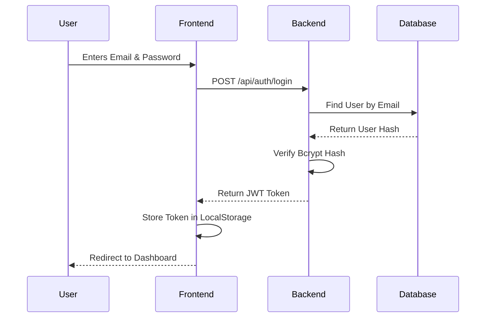

# System Architecture & Tech Stack

## 1. High-Level Architecture
The application follows a standard Client-Server architecture utilizing the MERN stack. The frontend communicates with the backend via RESTful APIs, and the backend communicates with the MongoDB database.

```mermaid
graph TD;
    Client[React.js Frontend\n(Vercel)] <--> |HTTPS / REST API| API[Node.js + Express Backend\n(Render)]
    API <--> |Mongoose ODM| DB[(MongoDB Atlas)]
    
    subgraph Frontend Architecture
    Client --> Context[AuthContext]
    Context --> Router[React Router]
    Router --> Pages[Dashboard, Login, Register]
    Pages --> Components[Employee Card, Forms, Navbar]
    end
    
    subgraph Backend Architecture
    API --> Middleware[Auth Middleware]
    Middleware --> Controllers[Auth & Employee Controllers]
    Controllers --> Models[User & Employee Schemas]
    end
```

## 2. Authentication Flow


## 3. Data Flow (Employee CRUD)
1. **Client Request:** The React frontend triggers an Axios HTTP request.
2. **API Interceptor:** Axios automatically attaches the JWT token from `localStorage` to the request header.
3. **Backend Middleware:** Express routes the request through the `authMiddleware` to verify the JWT.
4. **Controller Logic:** If authorized, the `employeeController` handles the request (parsing bodies, formatting queries).
5. **Database Interaction:** Mongoose executes the corresponding query (`.find()`, `.create()`, `.findByIdAndUpdate()`) on MongoDB.
6. **Response:** Data is sent back to the client as JSON.
